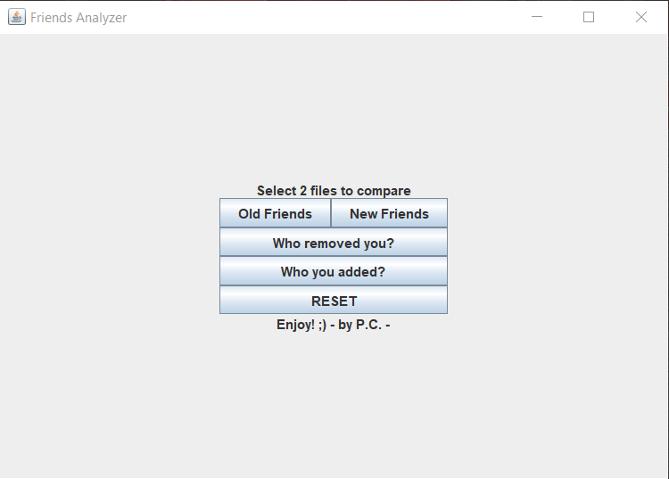
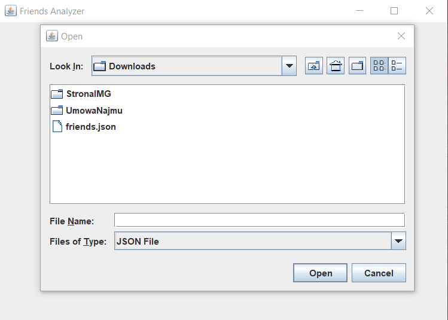
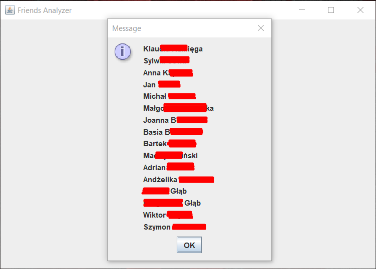
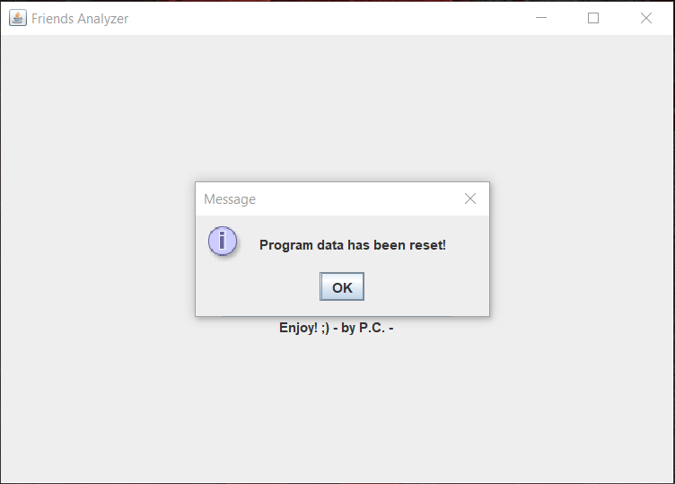
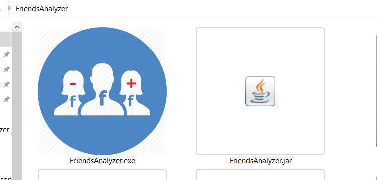

# FriendsAnalyzer
Facebook Friends Analyzer- desktop application. To compare two archive files, from past and from now, and return changes in your facebook friends list.

Project is created with:
* Java 11
* Maven
* Swing (GUI)
* Jackson (json object mapper)

### About the application

#### 0) Before you start- download your data from facebook (check only friends json from checkbox). 
    More information here: https://www.techwalla.com/articles/how-to-download-a-facebook-friends-list
    You need two diffrent friends.json files to use this program.
#### 1) Application start with simple main menu, created with Swing technology. 
    For normal use, we need two files: first- base file for example from 1-2 month ago (or from today).
    Second file is file with actual friends. In my case from yesterday (or from future).

#### 2) Base functionality based on two .json files which are compared to found who removed you from facebook friends, and who you add. 
    All the data used here is a data download from facebook to archive our data from facebook. 

#### 3) Function "Who removed you?" and "Who you added?" return the new dialog with results and shows it user. 
    I use character converter to show results in standard ISO-8859-1 from default UTF-8 (with polish characters).

#### 4) If you want change directors files to compare, u should use RESET button. 
    For more, i try protect the program from strange behavior with block try/catch(exp) communicate user what he should do. 

#### 5) Program ready to use for user, looks like here- with icon, with .exe file and .jar in same directory. 
    Just pack to .rar/.zip and send it to your friend and have fun :)

This is my first java desktop application created fully from documentation of libraries i used. 
Next time i use Java FX (MVC is more friendly for my). 
